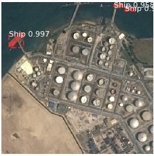

# Mask R-CNN for Object Detection and Segmentation

This is an implementation of [Mask R-CNN](https://arxiv.org/abs/1703.06870) on Python 3, Keras, and TensorFlow. The model generates bounding boxes and segmentation masks for each instance of an object in the image. It's based on Feature Pyramid Network (FPN) and a ResNet101 backbone.


The repository includes:
* Source code of Mask R-CNN built on FPN and ResNet101.
* Pre-trained weights for MS COCO
* Example of training on your own dataset

# Getting Started
* The google colab file [here](https://colab.research.google.com/drive/1osDmA7WpF3q3yH2FReZ5PPxd8i1nqnxW?usp=sharing) has the code to run the Mask R-CNN for object segemtation in image as well as for videos.

In the next sections we are going to look at various components of Mask R-CNN model.

## 1. Anchor sorting and filtering
Visualizes every step of the first stage Region Proposal Network and displays positive and negative anchors along with anchor box refinement.


## 2. Bounding Box Refinement
This is an example of final detection boxes (dotted lines) and the refinement applied to them (solid lines) in the second stage.


## 3. Mask Generation
Examples of generated masks. These then get scaled and placed on the image in the right location.


## 4. Composing the different pieces into a final result


# Training on MS COCO
We're providing pre-trained weights for MS COCO to make it easier to start. You can
use those weights as a starting point to train your own variation on the network.
Training and evaluation code is in `samples/coco/coco.py`. You can import this
module in Jupyter notebook (see the provided notebooks for examples) 


# Training on Your Own Dataset


## Requirements
Python 3.4, TensorFlow 1.3, Keras 2.0.8 and other common packages listed in `requirements.txt`.

### MS COCO Requirements:
To train or test on MS COCO, you'll also need:
* pycocotools (installation instructions below)
* [MS COCO Dataset](http://cocodataset.org/#home)
* Download the 5K [minival](https://dl.dropboxusercontent.com/s/o43o90bna78omob/instances_minival2014.json.zip?dl=0)
  and the 35K [validation-minus-minival](https://dl.dropboxusercontent.com/s/s3tw5zcg7395368/instances_valminusminival2014.json.zip?dl=0)
  subsets. More details in the original [Faster R-CNN implementation](https://github.com/rbgirshick/py-faster-rcnn/blob/master/data/README.md).


## Installation
1. Clone this repository
2. Install dependencies
   ```bash
   pip3 install -r requirements.txt
   ```
3. Run setup from the repository root directory
    ```bash
    python3 setup.py install
    ``` 
4. Download pre-trained COCO weights (mask_rcnn_coco.h5) from the [releases page](https://github.com/matterport/Mask_RCNN/releases).

5. Run the detection of the model from this file in the repository root directory
    ```bash
    demo.ipynb (Jupyter notebook)
    ```
6. You can also run the model on google colab from [here](https://colab.research.google.com/drive/1osDmA7WpF3q3yH2FReZ5PPxd8i1nqnxW#scrollTo=uLABmOZPJEfB). Here you can also upload images/videos of your choice and run the detection on it.  


## Projects Using this Model

# 1. **Video Object Segmentation**

We have extended this project for Video Object Segemtation which is object segmentation in video. We obtained good results for foreign as well as Indian roads. Here is the example of VOS for two different video streams :

# [Foreign Road Video Demo]
]


# [Indain Road Video Demo (CCTV footage)]
]

# 2. **Ship Detection using Satellite Imagery**

We also used the Transfer Learning approach to train the model for the task of Ship Detection using Satellite Imagery. The dataset we used was **Airbus Ship Dataset**. Here are some results we got after finetuning the pretrained model and training it on the given ship dataset.
] | ] 
